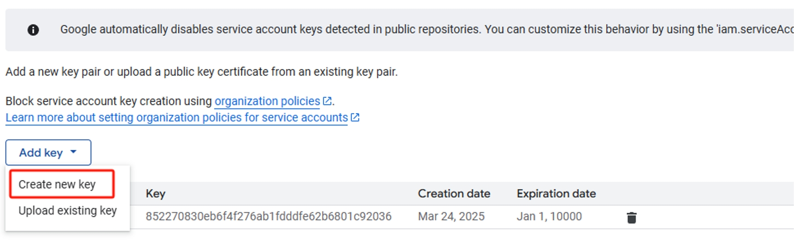
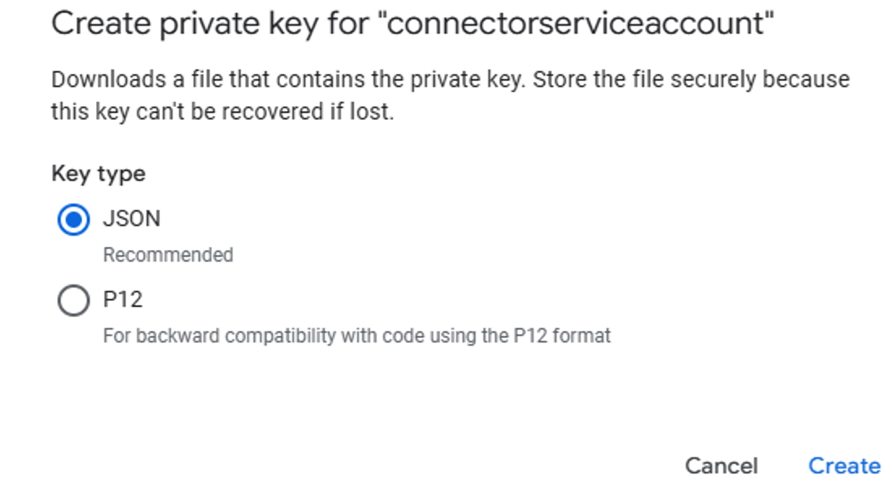
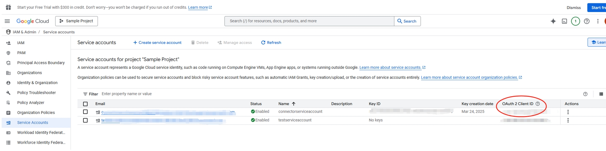

--- 

title: "Google Drive Microsoft Graph connector" 
ms.author: anggao
author: ms-anggao
manager: jecui
audience: Admin
ms.audience: Admin 
ms.topic: article 
ms.service: mssearch 
ms.localizationpriority: Medium 
search.appverid: 
- BFB160 
- MET150 
- MOE150 
description: "Set up the Google Drive Microsoft Graph connector for Microsoft Search and Microsoft 365 Copilot" 
ms.date: 09/19/2024
---

# Google Drive Microsoft Graph connector 

With the Microsoft Graph connector, your organization in Microsoft 365 can index files that are accessible to anyone in Google Drive, using Microsoft 365 Copilot and Microsoft Search. 

This article is for Microsoft 365 administrators or anyone who configures, runs, and monitors Microsoft Graph Google Drive connectors. 

## Capabilities
- Access Google Drive files using the power of semantic search.
- Retain ACLs (Access Control Lists) defined by your organization.
- Customize your crawl frequency
- Create workflows using this connection and plugins from Microsoft Copilot Studio.

## Limitations
- Folder replies & comments aren't indexable.
- Currently, only files that are accessible to anyone in Google Drive are indexed and visible to all Microsoft 365 users in your tenant, from Microsoft Search or Microsoft 365 Copilot

## Prerequisites
Before you create a Microsoft Graph Google Drive connector, you must:

### 1. Be a Google Workspace super admin role or be granted access
Either be granted access by a super admin role or be a user with administrative privileges. You do not need a super admin role for yourself if you have the access granted by a super admin role.

:::image type="content" source="media/google-drive-connector/gdrive-check-user-role.png" lightbox="media/google-drive-connector/gdrive-check-user-role.png" alt-text="Screenshot that shows how to check gdrive user role.":::

Check the user permission in the admin console: Admin center/manage user/user detail.

### 2. Create a Google Cloud Project

The Google Drive connector requires a service account key generated by a Google Cloud Platform console project. You can use an existing project you own or follow the following steps to create a new project:

a.	Go to the [Manage resources](https://console.cloud.google.com/cloud-resource-manager) page in the Google Cloud Platform console and click Create Project.

b.	In the New Project window that appears, add any project name, organization, and location of your choosing.

:::image type="content" source="media/google-drive-connector/gdrive-create-new-project.png" lightbox="media/google-drive-connector/gdrive-create-new-project.png" alt-text="Screenshot that shows how to create a new project in google drive.":::

c. Note the project ID (which is directly below the project name) as you'll need it when enabling APIs in step 3.

:::image type="content" source="media/google-drive-connector/gdrive-check-project-id.png" lightbox="media/google-drive-connector/gdrive-check-project-id.png" alt-text="Screenshot that shows how to find project ID.":::

d.	Click **Create**.

### 3. Enable the required API

In the project you created or in your existing project, ensure the following APIs are enabled by going to the link (replacing PROJECT_ID with your project ID) and clicking Enable if not already enabled:

:::image type="content" source="media/google-drive-connector/gdrive-enable-api.png" lightbox="media/google-drive-connector/gdrive-enable-api.png" alt-text="Screenshot that shows how to create a project in google drive.":::

Admin SDK API (admin.googleapis.com) 

https://console.developers.google.com/apis/api/admin.googleapis.com/overview?project=[PROJECT_ID]

Drive API (drive.googleapis.com) 

https://console.developers.google.com/apis/api/drive.googleapis.com/overview?project=[PROJECT_ID]

### 4. Create a Google Cloud Service Account

a.	Go to the [Service Accounts](https://console.cloud.google.com/projectselector2/iam-admin/serviceaccounts?inv=1&invt=Absc-w&supportedpurview=project) page in the Google Cloud Platform console and click the project you created.

:::image type="content" source="media/google-drive-connector/gdrive-create-service-account-1.png" lightbox="media/google-drive-connector/gdrive-create-service-account-1.png" alt-text="Screenshot that shows how to create service account-step1.":::

b.	Click **Create Service Account**.

:::image type="content" source="media/google-drive-connector/gdrive-create-service-account-2.png" lightbox="media/google-drive-connector/gdrive-create-service-account-2.png" alt-text="Screenshot that shows how to create service account-step2.":::

c.	Enter the service account name, ID, and description (optional), then click **Create and Continue**.

:::image type="content" source="media/google-drive-connector/gdrive-create-service-account-3.png"  alt-text="Screenshot that shows how to create service account-step3.":::

>[!NOTE]
>The project should be automatically populated from the name.

d.	Skip **Grant this service account access to project** and **Grant users access to this service account**. Click **Done**.

:::image type="content" source="media/google-drive-connector/gdrive-create-service-account-4.png" alt-text="Screenshot that shows how to create service account-step4.":::

e.	Back on the Service Accounts page for your project, you should now be able to see the service account that was created. Click the three dots below Actions and click **Manage Keys**.

:::image type="content" source="media/google-drive-connector/gdrive-manage-kyes.png" lightbox="media/google-drive-connector/gdrive-manage-kyes.png" alt-text="Screenshot that shows how to manage keys of service account.":::

f.	Click **Add Key** > **Create New Key**. In the panel that appears, select the key type JSON, then click Create.

g.	A private JSON key is saved to your computer.

### 5. Add the OAuth scopes to your service account

a.	Go to Google Workspace [Admin console](https://admin.google.com/ac/home?hl=en) and click **Security** > **Access and data control** > **API controls** in main menu.

:::image type="content" source="media/google-drive-connector/gdrive-add-api-scope-1.png" lightbox="media/google-drive-connector/gdrive-add-api-scope-1.png" alt-text="Screenshot that shows how to add api scope-step1.":::

b.	Click **MANAGE DOMAIN WIDE DELEGATION** in the section Domain wide delegation:

:::image type="content" source="media/google-drive-connector/gdrive-add-api-scope-2.png" lightbox="media/google-drive-connector/gdrive-add-api-scope-2.png" alt-text="Screenshot that shows how to add api scope-step2.":::

c.	Click **Add new** to add required scopes to the service account:

:::image type="content" source="media/google-drive-connector/gdrive-add-api-scope-3.png" lightbox="media/google-drive-connector/gdrive-add-api-scope-3.png" alt-text="Screenshot that shows how to add api scope-step3.":::

OAuth scopes (comma-delimited)

`https://www.googleapis.com/auth/admin.directory.user.readonly`

`https://www.googleapis.com/auth/admin.directory.group.readonly` 

`https://www.googleapis.com/auth/drive.readonly` 

>[!NOTE]
> How to obtain Client ID?
>
> Go to [Google Cloud console](https://console.cloud.google.com/iam-admin/serviceaccounts?inv=1&invt=AbtJpg&project=sample-project-454709), click service account in main menu, copy the "OAuth 2 Client ID" of the service account.

## Setup

### 1. Display name   
A display name is used to identify each reference in Copilot, helping users easily recognize the associated file or item. The display name also represents trusted content.

### 2. Add Google Apps domain
To sign up for Google Workspace, you need an internet domain name, like your-company.com. This domain can host a website (`www.your-company.com`) and email (`info@your-company.com`). For more information, see [What is a domain?](https://support.google.com/a/answer/177483?hl=en&ref_topic=3540977&sjid=7603839478714180429-AP).

### 3. Provide Google Apps administrator account email
Enter the email of a Google Apps administrator account in the `user@company.com` format.

### 4. Roll out to a limited audience
Deploy this connection to a limited user base if you want to validate it in Copilot and other search surfaces before expanding the rollout to a broader audience.

For other settings, like Access permissions, Data inclusion rules, Schema, Crawl frequency, etc., we set defaults based on what works best with data in Google Drive. The default values settings are as follows.

|Page|Settings|Default values|
|:--- |:---- |:---|
|Users | Access Permissions | All files that are accessible to anyone in Google Drive are visible to all Microsoft 365 users in your tenant, from Microsoft Search or Microsoft 365 Copilot.|
|Content | Index Content | All published posts and pages are selected by default.|
|Content | Manage Properties | To check default properties and their schema, [click here](#content).|
|Sync | Incremental Crawl | Frequency: Every 15 mins|
|Sync | Full crawl | Frequency: Every day|

## Custom setup 

In custom setup you can edit any of the default values for users, content, and sync. 

### Users 

#### Access permissions

The Google Drive Graphs connector supports data visible to Only people with access to this data source (recommended) or Everyone. If you choose Everyone, indexed data appears in the search results for all users. 

If you choose Only people with access to this data source, you need to further choose whether your  has Microsoft Entra ID provisioned users or non-AAD users. 

To identify which option is suitable for your organization: 

1. Choose the **Microsoft Entra ID** option if the email ID of Google Drive users is the same as the UserPrincipalName (UPN) of users in Microsoft Entra ID. 

2. Choose the **non-AAD** option if the email ID of Google Drive users is **different** from the UserPrincipalName (UPN) of users in Microsoft Entra ID.

>[!Important]
>- If you choose Microsoft Entra ID as the type of identity source, the connector maps the email IDs of users obtained from Google Drive directly to UPN property from Microsoft Entra ID.
>- If you chose "non-AAD" for the identity type, see Map your non-Azure AD Identities for instructions on mapping the identities. You can use this option to provide the mapping regular expression from email ID to UPN.
>- Updates to users or groups governing access permissions are synced in full crawls only. Incremental crawls do not currently support the processing of updates to permissions. 

### Content 

#### Manage properties
You can add or remove available properties from your PagerDuty Escalation Policy data source. Assign a schema, change the semantic label, and add an alias to the property. Some properties are indexed by default.

|Default property|Label|Description|Schema|
|--- | ---- | --- | ---|
|createdTime | Created date time | The time at which the file was created.  | Search, Query, Retrieve.|
|description |  | A short description of the file.| 
|fileExtension | File extension | The final component of fullFileExtension. This parameter is only available for files with binary content in Google Drive.  | Query, Refine, Retrieve.|
|fileType |  | The type of the file.  | 
|iconLink | IconUrl | A static, unauthenticated link to the file's icon.  | Retrieve.|
|lastModifingUser | lastModifiedDateTime | The last user to modify the file. This field is only populated when the last modification was performed by a signed-in user.  | Query, Retrieve, Search.|
|modifiedTime	| Last modified by | The last time the file was modified by anyone (Request For Comments 3339 date-time).  | Query, Retrieve, Search.|
|link | url | A link for opening the file in a relevant Google editor or viewer in a browser.  | Retrieve.|
|name | File Name | The name of the file.  | Query, Retrieve, Search.|
|owner | Created by | The owner of this file. Only certain legacy files may have more than one owner. This field isn't populated for items in shared drives.  | Search, Query, Retrieve.|
|parentFolderLink |  |  A link for the parent folder containing the file.  | Retrieve.|
|parentFolderName |  | The name of the parent folder containing the file.  | Search, Query, Retrieve.|
|size |  | Size in bytes of blobs and first-party editor files.  | Search, Query, Retrieve.|

### Sync 
You can configure full and incremental crawls based on the scheduling options present here. By default, incremental crawl is set for every 15 minutes, and full crawl is set for every day. If needed, you can adjust these schedules to fit your data refresh needs.

## Troubleshooting

1. Invalid credentials detected. Check the credential info and check the permissions of the service account.
This error occurs when the service account lacks the necessary permissions for Google Drive access. Check the credentials info of the account and ensure that they're correctly filled in on the setup page.

2. The required permissions for users/files are missing.
Authentication error, one or more required OAuth scopes for your service account are missing. Your service account must include both API scopes:

`https://www.googleapis.com/auth/admin.directory.user.readonly` 

`https://www.googleapis.com/auth/drive.readonly`

`https://www.googleapis.com/auth/admin.directory.group.readonly`

3. Failed to capture file information. Ensure the workspace isn't empty and has files accessible to the admin.
 During the connector setup, at least one file must be present in your organization's workspace to test the connection successfully.

## Next steps

After publishing your connection, you can review the status under **Data sources** in the [admin center](https://admin.microsoft.com). To learn how to make updates and deletions, see [Manage your connector](manage-connector.md).

If you have any other issues or want to provide feedback, reach out to us at [Microsoft Graph | Support](https://developer.microsoft.com/en-us/graph/support).
