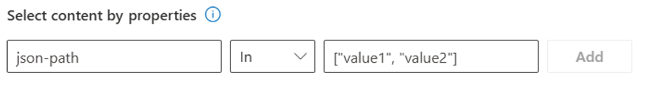
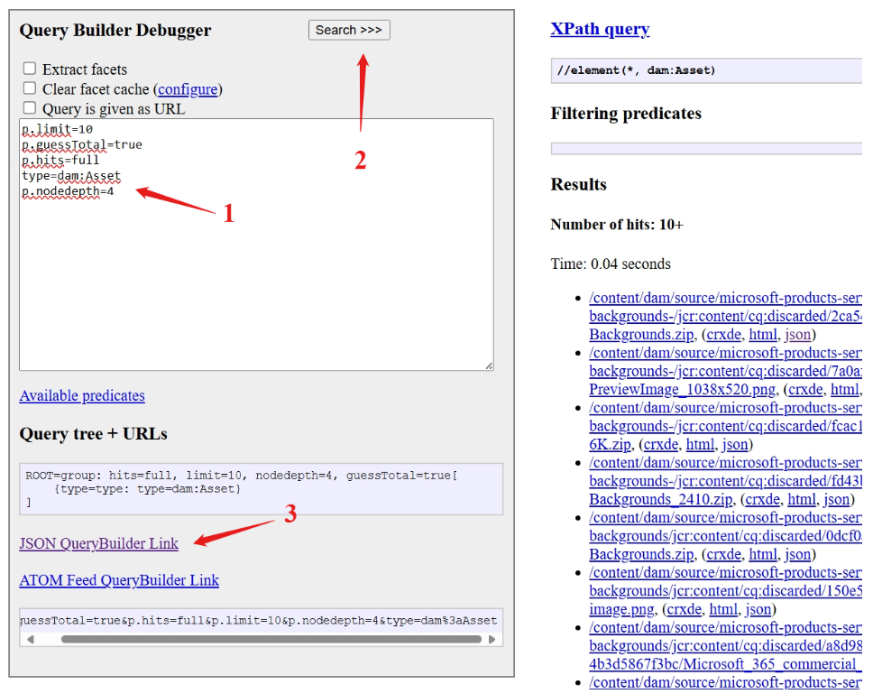
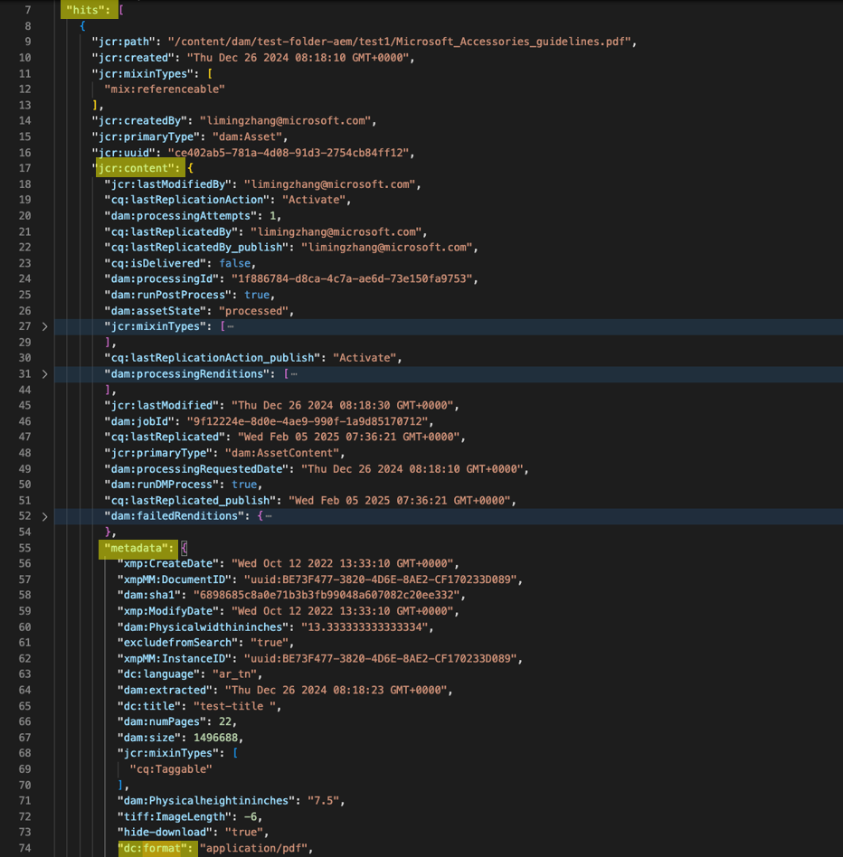
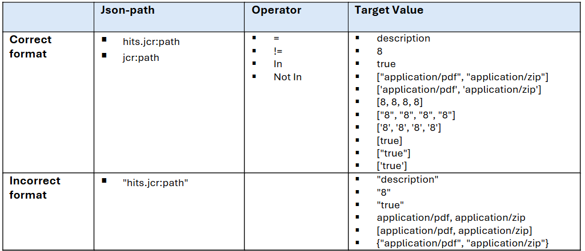
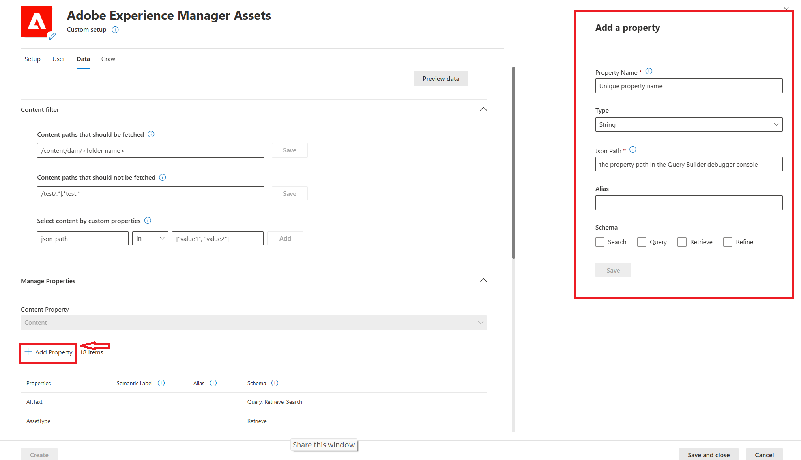

--- 

title: "Adobe Experience Manager(AEM) Assets Microsoft Graph connector" 
ms.author: rantang
author: ranran1998
manager: jecui
audience: Admin
ms.audience: Admin 
ms.topic: article 
ms.service: mssearch 
ms.localizationpriority: Medium 
search.appverid: 
- BFB160 
- MET150 
- MOE150 
description: "Set up the Adobe Experience Manager Assets Microsoft Graph connector for Microsoft Search and Microsoft 365 Copilot" 
ms.date: 03/14/2025
---

# Adobe Experience Manager Assets Microsoft Graph connector (preview)

With the Adobe Experience Manager Assets Microsoft Graph connector, your organization can index published assets of your Adobe Experience Manager Assets instance. After you configure the connector and index content from Adobe Experience Manager Assets, end users can search for those published assets in Microsoft Copilot and from any Microsoft Search client. 

This article is for Microsoft 365 administrators or anyone who configures, runs, and monitors an Adobe Experience Manager Assets Microsoft Graph connector. 

## Capabilities
- Index published assets of your Adobe Experience Manager Assets.
- Support ingestion filters based on page paths, allowing for exact matching and phrase matching using regular expressions.
- Customize your crawl frequency.
- Create workflows using this connection and plugins from Microsoft Copilot Studio.  
- Use [Semantic search in Copilot](semantic-index-for-copilot.md) to enable users to find relevant content.

## Limitations
- Doesn't index comments.
- Doesn't crawl user identities and access permissions. All published assets indexed using the Adobe Experience Manager Assets Microsoft Graph connector are visible to all Microsoft 365 users in your tenant, from Microsoft Search or Copilot.   

## Prerequisites
- You must be the **search admin** for your organization's Microsoft 365 tenant.
- **Adobe Experience Cloud Instance URL**: To connect to your Adobe Experience Manager Assets data, you need your organization's Adobe Experience Cloud instance author environment URL and publish environment URL.
  Your organization's Adobe Experience Cloud instance author environment URL typically looks like: `https://author-p<PROGRAM_ID>-e<ENVIRONMENT_ID>.<REGION>.adobeaemcloud.com`.
  Your organization's Adobe Experience Cloud instance publish environment URL typically looks like: `https://publish-p<PROGRAM_ID>-e<ENVIRONMENT_ID>.<REGION>.adobeaemcloud.com`. 
- **Adobe Experience Cloud Account**: To connect to Adobe Experience Cloud and allow the Adobe Experience Manager Assets Graph Connector to update published assets and metadata regularly, you need a technical account of your Adobe Experience Manager Assets with the credentials to access published assets and metadata. The technical account is the secure, service-based account for external access to Adobe Experience Manager Assets. Find more details [here](https://experienceleague.adobe.com/en/docs/experience-manager-cloud-service/content/implementing/developing/generating-access-tokens-for-server-side-apis#generate-a-jwt-token-and-exchange-it-for-an-access-token).

## Get started

### 1. Display name 
A display name is used to identify each citation in Copilot, helping users easily recognize the associated file or item. Display name also signifies trusted content. The display name is also used as a [content source filter](/MicrosoftSearch/custom-filters#content-source-filters). A default value is present for this field, but you can customize it to a name that users in your organization recognize.

### 2. Adobe Experience Cloud Instance URL
To correctly access and update data from the Adobe Experience Manager Assets, both the author and publish environment URLs are essential.   

### 3. Authentication Type
Authentication Type - We support the technical account for Adobe Experience Cloud. To enable and configure the technical account for Adobe Experience Manager Assets, find more details [here](https://experienceleague.adobe.com/en/docs/experience-manager-cloud-service/content/implementing/developing/generating-access-tokens-for-server-side-apis#generate-a-jwt-token-and-exchange-it-for-an-access-token).

### 4. Staged rollout to a limited audience
Deploy this connection to a limited user base if you want to validate it in Copilot and other Search surfaces before expanding the rollout to a broader audience.

At this point, you're ready to create the connection for Adobe Experience Manager Assets. You can click the **Create** button to publish your connection and index published web assets from your Adobe Experience Manager Assets. 

For other settings—such as Access Permissions, Data inclusion rules, Schema, and Crawl frequency—we set defaults based on what works best with Adobe Experience Manager Assets data. The default values are listed in the following table.

**Page** | **Settings** | **Default values**
--- | ---- | ---
Users | Access permissions | All published assets or posts indexed using the Adobe Experience Manager Assets Microsoft Graph connector are visible to all Microsoft 365 users in your tenant, from Microsoft Search or Copilot.
Content | Index content | All published assets are selected by default. 
Content | Manage properties | To check default properties and their schema, [click here](#content).
Sync | Incremental crawl | Frequency: Every 15 mins
Sync | Full crawl | Frequency: Every day

If you want to edit any of these values, you need to choose the **Custom setup** option. 

## Custom setup 

Custom setup is for those admins who want to edit the default values for settings. Once you click the **Custom setup** option, you should see three other tabs – **Users**, **Content**, and **Sync**. 

### Users 

**Access permissions**

Currently only published assets from your Adobe Experience Manager Assets are indexed. All data indexed using the Adobe Experience Manager Assets Microsoft Graph connector is visible to all Microsoft 365 users in your tenant, from Microsoft Search or Copilot.

### Content 

#### Content ingestion filters

You can choose to include or exclude certain content paths.  

- Content paths that should be fetched: Only support input exact paths. A valid content path must have at least three levels, starting with "/content/dam" as the first two segments. 

- Content paths that shouldn't be fetched: Only support input Java regular expression for paths. The priority of excluding content paths is higher than that of including content paths.


You can also set ingestion filters based on the value of **metadata properties**,including both standard metadata properties and custom metadata properties. Input the **json-path of the property**, select the **Operator** and input the **Target-value**. 



Following are the steps about **how to find and verify the property path** in the [Query Builder debugger console| Adobe Experience Manager](https://experienceleague.adobe.com/en/docs/experience-manager-cloud-service/content/implementing/developing/full-stack/search/query-builder-api#testing-and-debugging).

1. Open the Query Builder Debugger with `http://<host>:<port>/libs/cq/search/content/querydebug.html` and input the following query

```plaintext
p.limit=10
p.guessTotal=true
p.hits=full
type=dam:Asset
p.nodedepth=2
property=jcr:content/cq:lastReplicationAction
property.value=Activate
```

2. Click "**search**"

3. After the results successfully returned, click on "**JSON QueryBuilder Link**", then you can see the json content with all properties in a new tab.



4. Find the property and json-path of the property. For example, the json path of the property `dc:format` shown in the following snapshot is `hits.jcr:content.metadata.dc:format`



**Understanding Operators and Target Values in Query Conditions**
 **Operator**: A drop-down menu for setting `"="`, `"!="`, `"In"`, `"Not In"`.
 **Target-value**: Single-value and multi-value settings are different.
- Single-value usage in (=) and (!=) conditions: Give a single value without any quotes.
- Multi-value usage in (In) and (Not In) conditions: If multi-value is a group of text, enclose them in double quotes and square brackets []. If it’s a group of numbers, a user only needs to enclose them in square brackets []. It doesn’t matter if there are quotes or not. 

Following table shows the examples of correct and incorrect user input: 



Use the preview results button to verify the sample values of the selected properties and filters. 

#### Manage properties
**Standard properties**
Here, you can check available properties from your Adobe Experience Manager Assets and its schema. Define whether a property is searchable, queryable, retrievable, or refinable. Add a semantic label to the property and add an alias to the property.

| **Source property** | **Semantic label**       | **Description**                                                                 | **Schema**                  |
|----------------------|--------------------------|---------------------------------------------------------------------------------|-----------------------------|
| AltText          | None            | the "Alt Text" field in Adobe Experience Manager Assets metadata                     | Query, Retrieve, Search     |
| AssetType         | None              | The file type of the asset (for example, Image, Multimedia, Document etc.).                    |Retrieve  |
| Content         | `Content`                 | The content of documents, not available for images             | Search                      |
| CreatedBy           | `Created by`              | Date and time that the item was created in the data source                      | Query, Retrieve, Search     |
| CreatedTime         | `Created date time`       | Date and time that the item was created in the data source                      | Query, Retrieve             |
| Description         | `Description`             | A brief summary of the asset's content                                           | Query, Retrieve             |
| FileExtension         |`File extension`      | the suffix at the end of a file name, for example, .txt, .jpg, .exe             | Query, Refine, Retrieve           |
|FileName            |`Title`     | The file name of the asset           | Query, Retrieve, Search          |
| LastModifiedBy      | `Last modified by`        | Name of the person who most recently edited the item in the data source         | Search, Query, Retrieve     |
| Length    |None       | Image Length        | Query, Retrieve   |
| Link                | `URL`                     | The target URL of the item in the data source                                   | Retrieve             |
| ModifiedTime        | `Last modified date time` | Date and time the item was last modified in the data source                     | Query, Refine, Retrieve         |
| PublishedBy         | None            | Name of the person who published the item in the data source                    | Query, Retrieve, Search           |
| PublishedTime       | None     | Date and time the item was published in the data source                         | Query, Retrieve             |
|title            |  None               | The title of the items                                                      |Query, Retrieve, Search           |
| Width   |None       | Width        | Query, Retrieve   |
| Tags                | `Tags`                    | Tags defined in Adobe Experience Manager Assets metadata. In Adobe Experience Manager, tags are organized hierarchically   | Query, Retrieve, Search     |

**Add more properties**
The table lists only the standard properties of Adobe Experience Manager Assets by default, such as titles, tags, description, createdby, publishedby etc. If you would like to add more other properties besides these standard properties of Adobe Experience Manager Assets, you could click “**Add Property**” to add it. 




### Sync 

You can configure full and incremental crawls based on the scheduling options present here. By default, incremental crawl is set for every 15 minutes, and full crawl is set for every day. If needed, you can adjust these schedules to fit your data refresh needs.

## Troubleshooting
After publishing your connection, you can review the status under the **Data sources** tab in the [admin center](https://admin.microsoft.com). To learn how to make updates and deletions, see [Manage your connector](manage-connector.md).

If you have issues or want to provide feedback, contact [Microsoft Graph | Support](https://developer.microsoft.com/en-us/graph/support).
