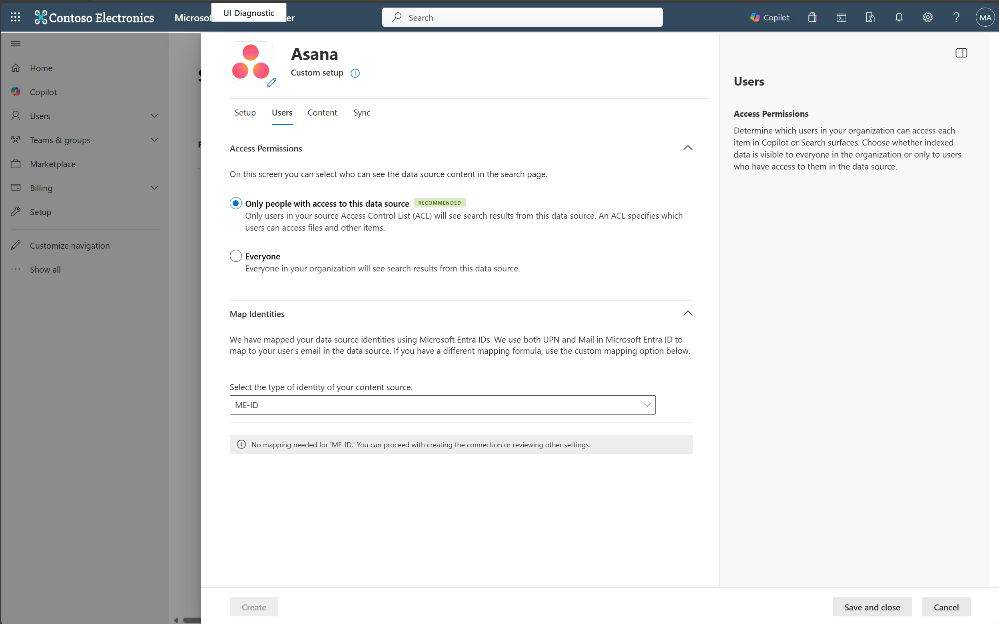
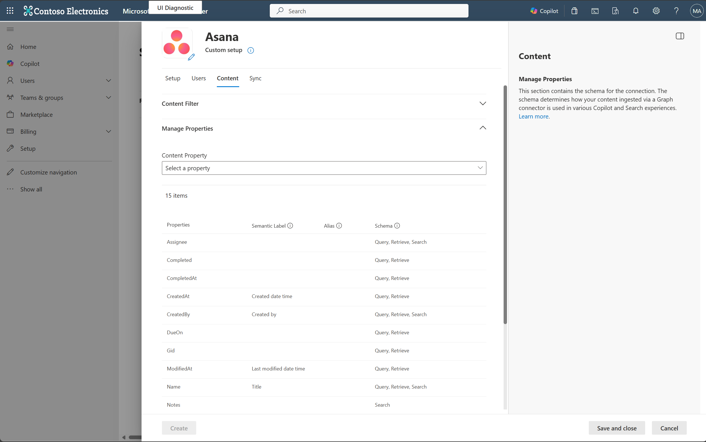
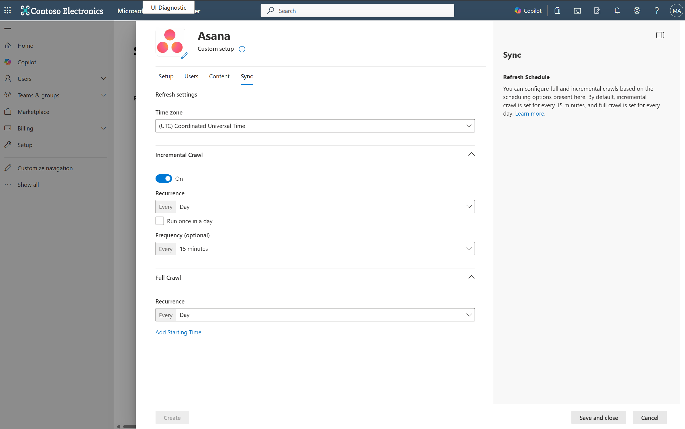

--- 
title: "Asana Microsoft Graph connector" 
ms.author:  kailiang
author: Kai-Cloud
manager: zezhangzhao
audience: Admin
ms.audience: Admin 
ms.topic: article 
ms.service: mssearch 
ms.localizationpriority: medium 
search.appverid: 
description: "Set up the Asana Microsoft Graph connector for Microsoft Search and Microsoft 365 Copilot." 
ms.date: 02/28/2025
---

# Asana Microsoft Graph connector

The Asana Microsoft Graph connector allows your organization to index Asana tasks. After you configure the connector and index content from the Asana workspaces, users can search for those items in Microsoft Search and Microsoft 365 Copilot.

This article is for Microsoft 365 administrators or anyone who configures, runs, and monitors an Asana Microsoft Graph connector.

## Capabilities

- Index tasks.
- Enable your users to ask questions related to project tracking and task information in Copilot. For example:
   - Identify tasks that haven't been assigned across all my projects.
   - Identify any overdue tasks in a project.
   - Summarize my tasks for the next two weeks.
- Use [semantic search in Copilot](semantic-index-for-copilot.md) to enable users to find relevant content based on keywords, personal preferences, and social connections.

## Limitations
- The connector doesn't index comments.
- The connector doesn't index customized fields.

## Prerequisites
- You must be the search admin for your organization's Microsoft 365 tenant.
- To connect to your Asana workspace, you need the Asana URL. The URL is typically the following: `https://app.asana.com`.
- To connect to Asana and allow the Microsoft Graph connector to update Asana tasks regularly, you need a service account with read permissions. The service account must have the Admin role.

## Get started

### 1. Choose a display name 
The display name is used to identify each citation in Copilot to help users easily recognize the associated file or item. The display name also signifies trusted content and is used as a [content source filter](/MicrosoftSearch/custom-filters#content-source-filters). 

A default value is provided; you can customize it to a name that users in your organization recognize.

### 2. Add the Asana URL
To connect to your Asana workspace, you need the Asana URL. The URL is typically the following: `https://app.asana.com`.

### 3. Choose the authentication type
To use **Asana OAuth** for authentication, an Asana admin needs to create an app in the [Asana developer console](https://app.asana.com/0/my-apps).

Use the information in the following table to complete the OAuth client creation form.

Field | Description | Recommended value
--- | --- | ---
App name | Unique value that identifies the application that you require OAuth access for. | Microsoft Search
Which best describes what your app will do? | Describe the purpose of the app. | Get data out of Asana to create reports.
Redirect URL | A required callback URL that the authorization server redirects to. | For **Microsoft 365 Enterprise**: `https://gcs.office.com/v1.0/admin/oauth/callback`  For **Microsoft 365 Government**: `https://gcsgcc.office.com/v1.0/admin/oauth/callback`
Manage distribution | Choose workspaces to be distributed. | Add specific workspaces that the connector can access or select **Any workspace**.
   
Copy the client ID and client secret from the OAuth tab in the Asana app that you created and paste it in the connector setup. Choose **Authorize**, and use the same Asana admin account credential to authenticate permission to crawl.

> [!NOTE]
> You need to authorize access to the Asana app in a popup window. Make sure that your browser permits popup windows or grant access if the popup window is blocked.

### 4. Roll out to a limited audience
Deploy the connection to a limited user base if you want to validate it in Copilot and other Search surfaces before you roll it out to a broader audience. For more information, see [Staged rollout for connectors](staged-rollout-for-graph-connectors.md).

At this point, you're ready to create the connection for Asana. Choose **Create** to publish your connection and index articles from your Asana account.

For other settings, like **Access permissions**, **Schema**, and **Crawl frequency**, default values are set based on what works best with Asana data.

| Users | Description |
|----|---|
| Access permissions | Only people with access to content in Data source. |
| Map identities | Data source identities mapped using Microsoft Entra IDs. |

| Content | Description |
|---|---|
| Manage properties | For information about the default properties and their schema, see [content](#content). |

| Sync | Description |
|---|---|
| Incremental crawl | Runs every 15 minutes. |
| Full crawl | Runs every day. |

If you want to edit any of these values, choose the **Custom setup** option.

## Custom setup

Custom setup is for admins who want to edit the default values for any settings. When you choose **Custom setup**, you see three other tabs: **Users**, **Content**, and **Sync**. 

### Users

#### Access permissions

The Asana Microsoft Graph connector supports search permissions visible to **Everyone** or **Only people with access to this data source**. If you choose **Everyone**, indexed data appears in the search results for all users. If you choose **Only people with access to this data source**, indexed data appears in the search results for users who have access to them. In Atlassian Asana, security permissions are defined using project permission schemes containing site-level groups and project roles. Task-level security can also be defined using task-level permission schemes.

#### Mapping identities

The default method to map your data source identities with Microsoft Entra ID is to verify that the email ID of Asana users is the same as the user principal name (UPN) of the users in Microsoft Entra ID. If the default mapping doesn't work for your organization, you can provide a custom mapping formula. For more information, see [Map your non-Azure AD Identities](map-non-aad.md).

To identify which option is best for your organization:

1. Choose the **Microsoft Entra ID** option if the email ID of Asana users is the *same* as the UPN in Microsoft Entra ID.
2. Choose the **Non-Microsoft Entra ID** option if the email ID of Asana users is *different* than the users' UPN and email in Microsoft Entra ID.

### Content

#### Manage properties

You can add or remove available properties from your Asana, assign a schema to the property (define whether a property is searchable, queryable, retrievable, or refinable), change the semantic label, and add an alias to the property. The following table lists the default properties.

|Source property|Label|Description|Schema|
|---|---|---|---|
| Assignee |Not applicable| The person who should complete this task | Query, Retrieve, Search |
| Completed | Not applicable | The main body of the article|  Query, Retrieve |
| CompletedAt |Not applicable | Date and time that the task was completed | Query, Retrieve |
| CreatedAt | Created date time | Date and time that the task was created | Query, Retrieve |
| CreateBy | Created by | The person who created this task | Query, Retrieve, Search |
| DueOn |Not applicable | When this task should be completed | Query, Retrieve |
| Gid | Not applicable| Global ID of this task | Query, Retrieve |
| ModifiedAt | Last modified date time | Date and time that the task was modified | Query, Retrieve |
| Name | Title | Task name | Query, Retrieve, Search |
| Notes |Not applicable  | Description of the task | Search |
| ProjectIds |Not applicable | Project IDs |Not applicable|
| ProjectNames | Not applicable| Project names | Query, Retrieve |
| Tags | tags | Tags assigned to this task | Query, Retrieve |
| TaskUrl | url | The link of the task | Query, Retrieve, Search |
| WorkspaceName | Not applicable| Workspace name | Query, Retrieve, Search |

#### Preview data

Use the preview results button to verify the sample values of the selected properties and query filter.

### Sync

The refresh interval determines how often your data is synced between the data source and the Asana Microsoft Graph connector index. There are two types of refresh intervals - full crawl and incremental crawl. For more information, see [refresh settings](configure-connector.md#guidelines-for-sync-settings).

You can change the default values of the refresh interval.

## Next steps
After you publish your connection, you can review the status under the **Data Sources** tab in the [admin center](https://admin.microsoft.com). To learn how to make updates and deletions, see [Manage your connector](manage-connector.md).

If you have issues or want to provide feedback, see [Microsoft Graph support](https://developer.microsoft.com/en-us/graph/support).
