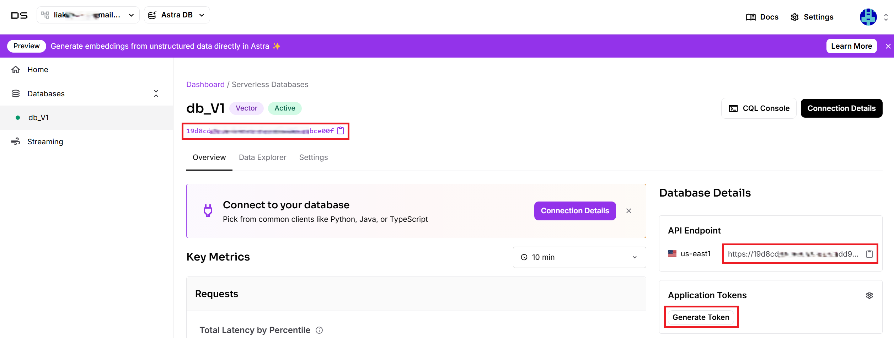

--- 
title: "DataStax Microsoft Graph connector" 
ms.author:  kailiang
author: Kai-Cloud
manager: zezhangzhao
audience: Admin
ms.audience: Admin 
ms.topic: article 
ms.service: mssearch 
ms.localizationpriority: medium 
search.appverid: 
description: "Set up the DataStax Microsoft Graph connector for Microsoft 365 Copilot and Microsoft Search." 
ms.date: 04/08/2025
---

# DataStax Microsoft Graph connector

The DataStax Microsoft Graph connector allows your organization to index records in your DataStax Astra DB collections. After you configure the connector and index content from the DataStax databases, users can search for those items in Microsoft 365 Copilot.

This article is for Microsoft 365 administrators or anyone who configures, runs, and monitors the DataStax Microsoft Graph connector.

## Capabilities
- Index records in DataStax Astra DB collections.
- Enable your users to ask for advice based on the knowledge from DataStax in Copilot. For example, you have configured the connector to access the collection of movie reviews in DataStax:
   - Recommend a movie based on review texts and your interest.
   - Summarize the review text on movie Paa.
   - Identify the movie generating heated discussions.

## Limitations
- The connector doesn't index Non-Vector DB.
- The connector doesn't index Langflow.
- The connector doesn't support search verticals.

## Prerequisites
- You must be the search admin for your organization's Microsoft 365 tenant.
- To connect to your DataStax database, you need the DataStax API Endpoint and database ID.
- To connect to DataStax and allow the Microsoft Graph connector to update DataStax tasks regularly, you need an application token with read permissions.

## Get started

### 1. Choose a display name 
The display name is used to identify each citation in Copilot to help users easily recognize the associated file or item. The display name also signifies trusted content and is used as a [content source filter](/MicrosoftSearch/custom-filters#content-source-filters).

A default value is provided; you can customize it to a name that users in your organization recognize.

### 2. Add the DataStax API Endpoint
To connect to your DataStax database, you need the DataStax API Endpoint. The endpoint can be found in the overview of your database and is typically the following: `https://<your-database-id>-<region>.apps.astra.datastax.com`.

### 3. Add the DataStax database ID
To connect to your DataStax database, you need the DataStax database ID. The database ID can be found in the overview of your database.

### 4. Generate the Application Token
To use **DataStax Application Token** for authentication, a DataStax admin needs to generate the application token for the database with a proper user role, such as using "Read Only User".

Copy the generated application token from the token details which is typically a long string starts with "AstraCS:..." and paste it in the connector setup. Choose **Authorize**, and use the same token to authenticate permission to crawl.

### 5. Roll out to a limited audience
Deploy the connection to a limited user base if you want to validate it in Copilot and other Search surfaces before you roll it out to a broader audience. For more information, see [Staged rollout for connectors](staged-rollout-for-graph-connectors.md).

At this point, you're ready to create the connection for DataStax. Choose **Create** to publish your connection and index articles from your DataStax account.

For other settings, like **Access permissions**, **Schema**, and **Crawl frequency**, default values are set based on what works best with DataStax data.

| Users | Description |
|----|---|
| Access permissions | Only people with access to content in Data source. |
| Map identities | Data source identities mapped using Microsoft Entra IDs. |

| Content | Description |
|---|---|
| Manage properties | For information about the default properties and their schema, see [content](#content). |

| Sync | Description |
|---|---|
| Full crawl | Runs every day. |

## Custom setup

In custom setup you can edit any of the default values for users, content, and sync.

### Users

#### Access permissions

The DataStax Microsoft Graph connector supports search permissions visible to **Everyone** or **Only people with access to this data source**. If you choose **Everyone**, indexed data appears in the search results for all users. If you choose **Only people with access to this data source**, indexed data appears in the search results for users who have access to them. In Atlassian DataStax, security permissions are defined using project permission schemes containing site-level groups and project roles. Task-level security can also be defined using task-level permission schemes.

#### Mapping identities

The default method to map your data source identities with Microsoft Entra ID is to verify that the email ID of DataStax users is the same as the user principal name (UPN) of the users in Microsoft Entra ID. If the default mapping doesn't work for your organization, you can provide a custom mapping formula. For more information, see [Map your non-Azure AD Identities](map-non-aad.md).

To identify which option is best for your organization:

1. Choose the **Microsoft Entra ID** option if the email ID of DataStax users is the *same* as the UPN in Microsoft Entra ID.
2. Choose the **Non-Microsoft Entra ID** option if the email ID of DataStax users is *different* than the users' UPN and email in Microsoft Entra ID.

### Content

#### Manage properties

To view available properties from your DataStax data source, assign a schema to the property (define whether a property is searchable, queryable, retrievable, or refinable), change the semantic label, and add an alias in the property. Some properties are selected by default.

|Default property|Label|Description|Schema|
|:---|:---|:---|:---|
| Collection | Not applicable | The collection name | Query, Retrieve, Search. |
| Content | Not applicable | The record in the collection | Search. |
| IconUrl | IconUrl | The icon url of the record | Retrieve. |
| Id | url | The record ID in the collection | Query, Retrieve. |
| Keyspace | Not applicable | The person who created this task | Query, Retrieve, Search. |
| Title | Title | The title created by combining the collection name and the record ID  | Query, Retrieve, Search. |

#### Preview data
Use the preview results button to verify the sample values of the selected properties and query filter.

### Sync

The refresh interval determines how often your data is synced between the data source and the DataStax Microsoft Graph connector index. The DataStax graph connector only supports the refresh interval - full crawl. For more information, see [refresh settings](configure-connector.md#guidelines-for-sync-settings).

You can change the default values of the refresh interval.

## Next steps
After you publish your connection, you can review the status under **Data Sources** in the [admin center](https://admin.microsoft.com). To learn how to make updates and deletions, see [Manage your connector](manage-connector.md).

If you have issues or want to provide feedback, see [Microsoft Graph support](https://developer.microsoft.com/en-us/graph/support).
