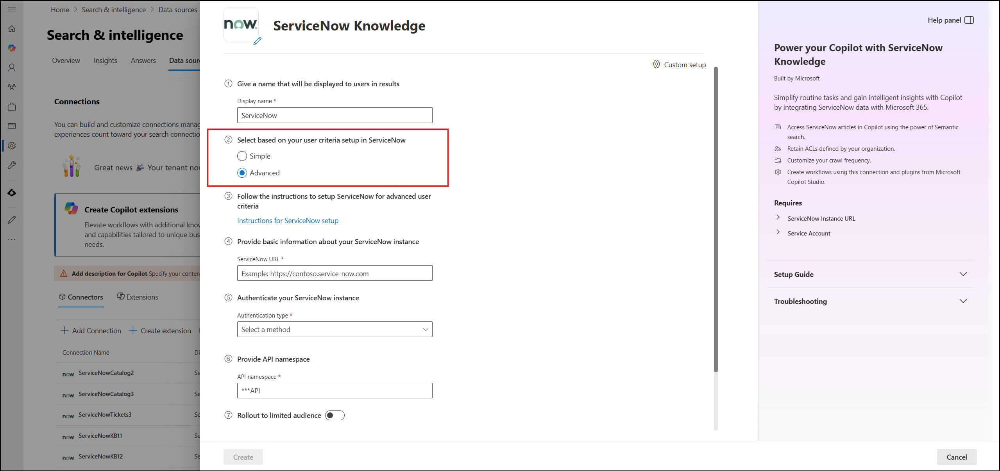
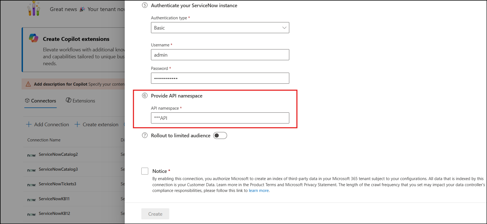

# Advanced Flow for Microsoft Graph Connector for ServiceNow Knowledge

If your ServiceNow instance uses **Advanced Scripts** in your Knowledge Base or Article-level user criteria, you'll need to use the **Advanced** flow. This ensures accurate permissions handling when ingesting content into Microsoft Graph.

## Step 1: Select Advanced Flow in Setup

When setting up the Microsoft Graph Connector for ServiceNow Knowledge, select the **Advanced** option under the field 'Select based on your user criteria setup in ServiceNow'. This is crucial for handling advanced user criteria correctly.



## Step 2: Configure Scripted REST API in ServiceNow

To allow the connector to fetch advanced user criteria, you must create a **Scripted REST API** in your ServiceNow instance. Follow the steps below.

### 2.1: Elevate User Role

1. Elevate your role in ServiceNow to `security_admin`.

### 2.2: Create Access Control (ACL)

1. In ServiceNow, navigate to **All > System Security > Access Control (ACL)**.
2. Click **New** to create a new ACL.
3. Set the following values:
   - **Type**: `REST_Endpoint`
   - **Operation**: `Execute`
   - **Name**: `Microsoft Copilot`
   - **Role**: `admin` *(or the same role assigned to the crawling account)*
4. Click **Submit**.

### 2.3: Create Scripted REST API

1. Navigate to **All > System Web Services > Scripted Web Services > Scripted REST APIs**.
2. Click **New**.
3. Enter the following:
   - **Name**: `Microsoft Copilot`
   - **API ID**: `microsoft_copilot`
4. Click **Submit**.

5. From the Scripted REST API list page, click on `Microsoft Copilot` - the REST API you just created.
6. Set **Default ACLs** to `Microsoft Copilot` (from step 2.2).

### 2.4: Add a Resource to the API

1. In the **Resources** tab, click **New**.
2. Fill in the details:
   - **Name**: `GetAllUserCriteria`
   - **Relative Path**: `/user_criteria`
   - **Script**: Paste the following code:

```js
(function execute (/*RESTAPIRequest*/ request, /*RESTAPIResponse*/ response) {
    var queryParams = request.queryParams;
    var user = new String(queryParams.user);
    return (new sn_uc.UserCriteriaLoader()).getAllUserCriteria(user);
})(request, response);
```

3. Make sure both of the following are checked:
   - **Requires authentication**
   - **Requires ACL authorization**

4. Ensure **ACLs** is set to `Microsoft Copilot`.

5. Click **Update**.

### 2.5: Verify Setup

1. Confirm that the **Resource Path** is:
   ```
   /api/<API Namespace>/microsoft_copilot/user_criteria
   ```
2. Click **Update** to save the configuration.

## Step 3: Enter the API Namespace in the Graph Connector Setup Experience
In the Microsoft Graph Connector setup, enter the **API Namespace** you created in ServiceNow.

   >[!NOTE]
   > You can find the API namespace in the Resource Path field shown in Step 2.5. You only need the namespace portion - not the full path.

   > For example: If the Resource Path is ```/api/abcdef/microsoft_copilot/user_criteria```, then the API namespace is ```abcdef```.

   