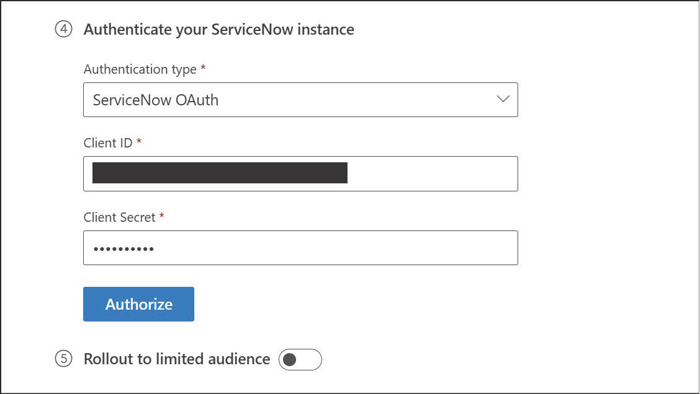
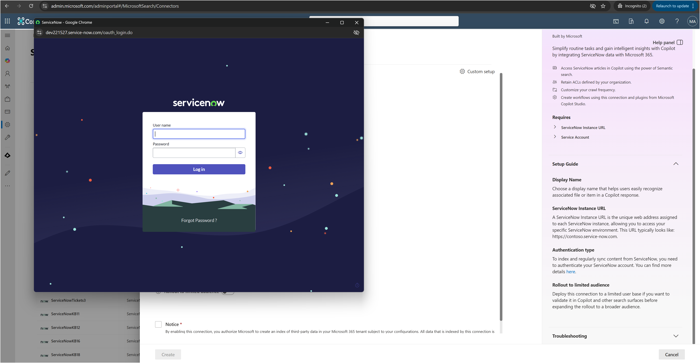
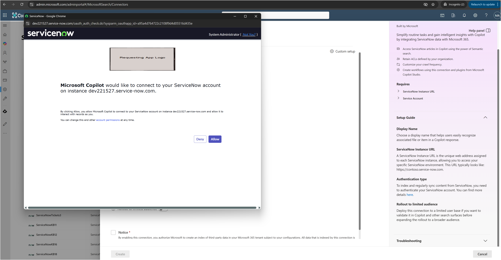
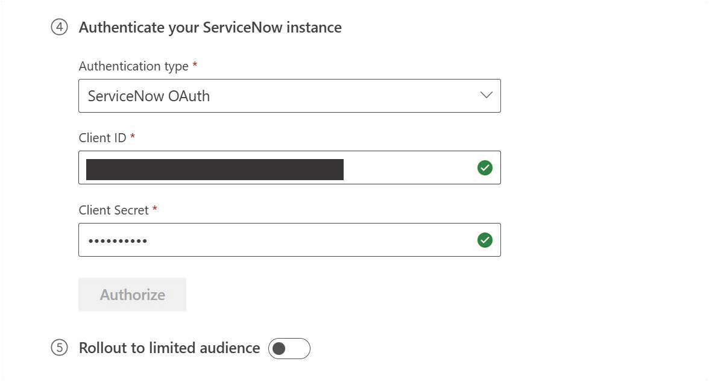

# Authenticating using OAuth 2.0

To securely authenticate your ServiceNow instance using OAuth 2.0, follow the steps below:

## Step-by-Step Instructions

1. **Enter OAuth Credentials**  
   In the authentication section of the connector setup screen, input the following:
   - **Client ID** – Provided during your OAuth application registration.
   - **Client Secret** – Keep this confidential and store it securely.

    

2. **Initiate Authorization**  
   Click the **‘Authorize’** button to begin the OAuth flow.

3. **Log in to ServiceNow**  
   A pop-up window will appear. If you're not already signed in, you’ll be prompted to log in to your ServiceNow instance.  
   > Use the **same account** that was used to register the OAuth application.

      

4. **Grant Permissions**  
   Once logged in, you’ll be asked to **grant access** to the application to read data from your ServiceNow instance.  
   Click **‘Allow’** to proceed.

      

5. **Verify Authentication**  
   After granting access, you’ll be redirected back to the setup screen.  
   - A **green checkmark** next to the authentication fields confirms successful authentication.  

      