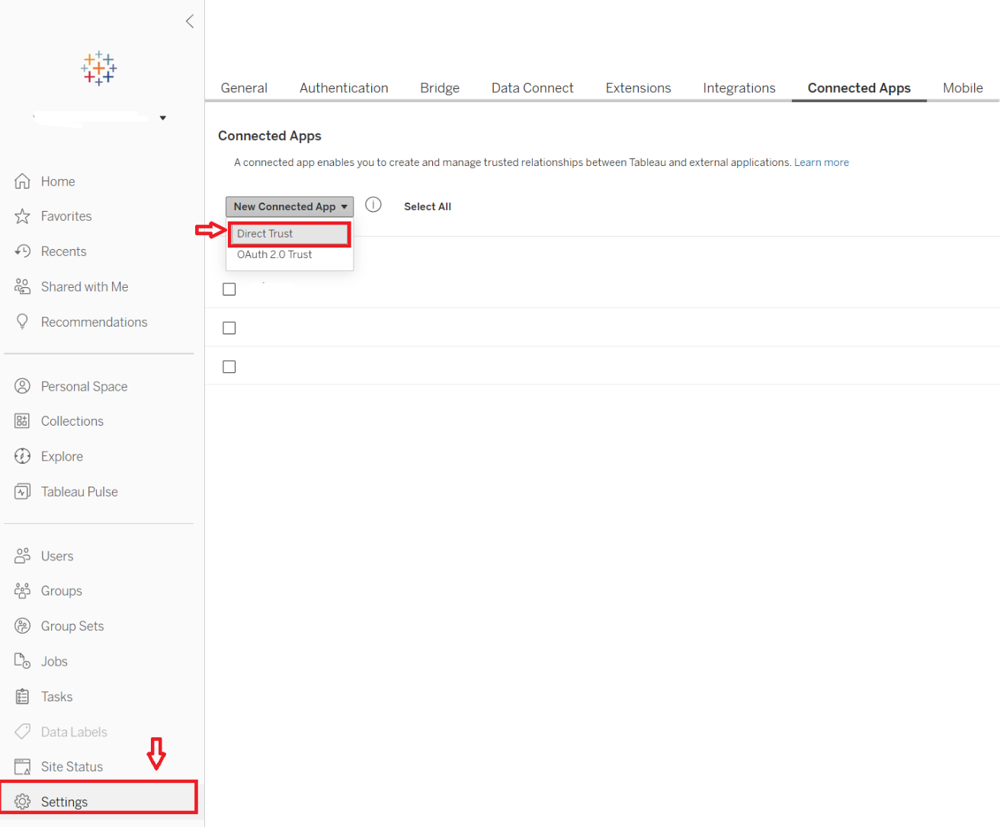
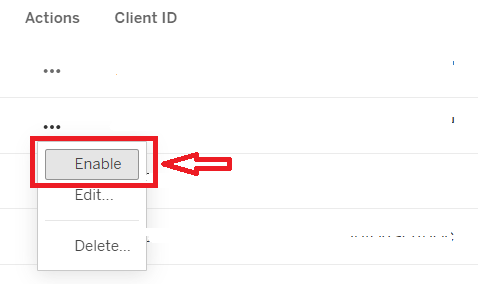
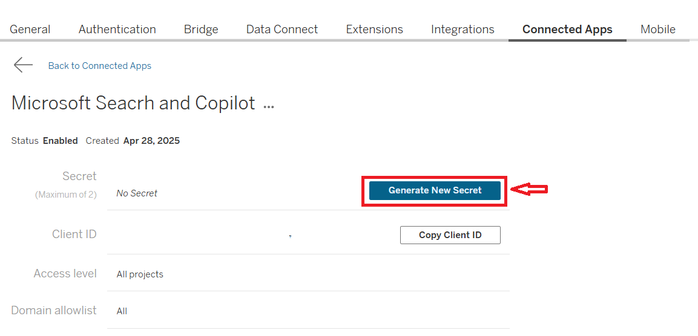
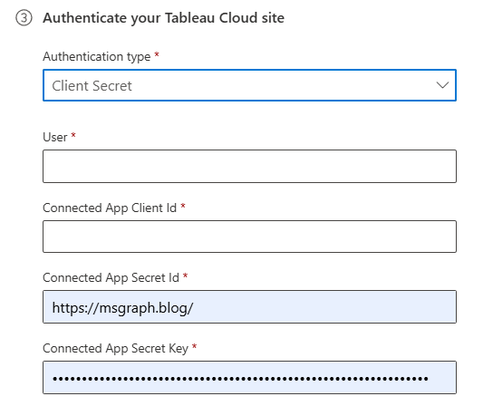
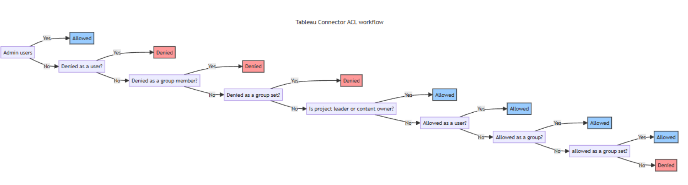

--- 

title: "Tableau Cloud Microsoft Graph connector" 
ms.author: rantang
author: ranran1998
manager: jecui
audience: Admin
ms.audience: Admin 
ms.topic: article 
ms.service: mssearch 
ms.localizationpriority: Medium 
search.appverid: 
- BFB160 
- MET150 
- MOE150 
description: "Set up the Tableau Cloud Microsoft Graph connector for Microsoft Search and Microsoft 365 Copilot" 
ms.date: 3/14/2025
---

# Tableau Cloud Microsoft Graph connector (preview)

With the Tableau Cloud Microsoft Graph connector, your organization can index Tableau sheets of your Tableau Cloud. After you configure the connector and index content from Tableau Cloud, end users can search for those sheets in Microsoft Copilot and from any Microsoft Search client.

This article is for Microsoft 365 administrators or anyone who configures, runs, and monitors a Tableau Cloud Microsoft Graph connector. 

## Capabilities
- Index sheets of your Tableau Cloud and supports ingestion filters based on top-level projects.
- Retain access control lists (ACLs) defined by your organization
- Customize your crawl frequency.
- Create workflows using this connection and plugins from Microsoft Copilot Studio.  
- Use [Semantic search in Copilot](semantic-index-for-copilot.md) to enable users to find relevant content.

## Limitations
- sheets in personal space aren't indexable

## Prerequisites
- You must be the **search admin** for your organization's Microsoft 365 tenant.
- **Configure Connected Apps with Direct Trust in Tableau**: To connect to Tableau Cloud and enable the Tableau Cloud Microsoft Graph connector to sync sheets regularly, you need to configure and enable Connected Apps with Direct Trust on your Tableau site, using credentials that can access the sheets. Tableau Connected Apps provide a seamless and secure authentication experience by establishing an explicit trust relationship between your Tableau Cloud site and external applications. Find more details [here](https://help.tableau.com/current/online/en-us/connected_apps_direct.htm?_gl=1*9bs6y1*_ga*MTk1OTAyNzg0MS4xNzIxMTIwMzA4*_ga_8YLN0SNXVS*MTczNTE5MzU5OS4zNC4xLjE3MzUyMDA1ODEuMC4wLjA.).

## Get started

### 1. Display name 
A display name is used to identify each citation in Copilot, helping users easily recognize the associated file or item. Display name also signifies trusted content. The display name is also used as a [content source filter](/MicrosoftSearch/custom-filters#content-source-filters). A default value is present for this field, but you can customize it to a name that users in your organization recognize.

### 2. Tableau Cloud Site URL
A Tableau Cloud site URL typically looks like `https://<your-domain>.online.tableau.com/#/site/<site-name>`

### 3. Authentication Type
To enable and configure the Connected Apps with Direct Trust for Tableau Cloud, use the following steps to use Tableau Connected Apps with Direct Trust for authentication.

**Step 1: Create a Tableau Connected Apps with Direct Trust**
Create a connected app from Tableau Cloud’s Settings page.
1. As a site admin, sign in to Tableau Cloud.
2. From the left pane, select **Settings > Connected Apps**.

3. Select the New Connected App button drop-down arrow and select **Direct Trust**.
4. Use the information in the following table to fill out the **Create Connected App dialog box**.

Field | Description | Recommended Value
--- | --- | ---
Connected app name| Unique value that identifies the application that you require Direct Trust for. | Microsoft Search and Copilot
Access Level | To control which views or metrics can be embedded, select "All projects" or "Only one project". If you select the "Only one project" option, select the specific project to scope to. For more information about these two options, see [Access level (embedding workflows only)](https://help.tableau.com/current/online/en-us/connected_apps_direct.htm?_gl=1*9bs6y1*_ga*MTk1OTAyNzg0MS4xNzIxMTIwMzA4*_ga_8YLN0SNXVS*MTczNTE5MzU5OS4zNC4xLjE3MzUyMDA1ODEuMC4wLjA.#projects).|"All project" or "Only one project"
Domain allowlist|the domains where views or metrics can be embedded|All domains

When finished, select the Create button.
  

5. Next to the connected app's name, select the actions menu and select **Enable**.
  

**Step 2: Generate a secret**
1. On the detail page of the connected app you created in Step 1, select the **Generate New Secret** button.
  
2. Make note of the **Secret ID** ，**Secret Value** and **Client ID** to use in Step 3 below.

**Step3: Enter the required fields of Tableau Graph Connector Authentication**.

Enter the User, Connected App Client ID, Connected App Secret ID and Connected App Secret Key to connect to your Tableau Cloud Site. 
 

Refer to the following table to learn the descriptions of the required fields of Tableau Graph Connector Authentication
Field | Description 
--- | --- 
User| The admin user email. Recommend to fill the email of an admin user who configured the Tableau Connected Apps with Direct Trust.
Connected App Client ID| **Client ID** of the Tableau Connected Apps with Direct Trust, refer to the value noted in the Step 2 above.
Connected App Secret ID| **Secret ID** of the Tableau Connected Apps with Direct Trust, refer to the value noted in the Step 2 above.
Connected App Secret Key| **Secret Value** of the Tableau Connected Apps with Direct Trust, refer to the value noted in the Step 2 above.

### 4. Staged rollout to a limited audience
Deploy this connection to a limited user base if you want to validate it in Copilot and other Search surfaces before expanding the rollout to a broader audience.

At this point, you're ready to create the connection for Tableau Cloud. You can click the **Create** button to publish your connection and index sheets from your Tableau Cloud Site. 

For other settings, like Access Permissions, Data inclusion rules, Schema, Crawl frequency, etc., we set defaults based on what works best with Tableau Cloud data. The default values are as follows: 

**Page** | **Settings** | **Default values**
--- | ---- | ---
Users | Access permissions | Only people with access to this data source.
Users | Map Identities |Data source identities mapped using Microsoft Entra IDs.
Content | Index content | All sheets, except the sheets in personal space. 
Content | Manage properties | To check default properties and their schema, [click here](#content).
Sync | Incremental crawl | Frequency: Every 15 mins
Sync | Full crawl | Frequency: Every day

If you want to edit any of these values, you need to choose the **Custom setup** option. 

## Custom setup 

Custom setup is for those admins who want to edit the default values for settings. Once you click the **Custom setup** option, you should see three other tabs – **Users**, **Content**, and **Sync**. 

### Users 

**Access permissions**

The Tableau Cloud Microsoft Graph connector supports data visible to **Only people with access to this data source (recommended)** or Everyone. If you choose Everyone, indexed data appears in the search results for all users. 

>[!NOTE]
>Tableau's ACL ([Effective permissions - Tableau](https://help.tableau.com/current/online/en-us/permission_effective.htm#EvaluatePermRules)) system uses a layered evaluation mechanism to calculate users' effective permissions. When you select "**Only people with access to this data source**" while configuring the Tableau Cloud Graph Connector, the connector applies a logic similar to Tableau’s native ACL system. This mechanism ensures that the content indexed by the Graph Connector is **not overshared** with users who don't have appropriate permissions within Tableau Cloud Sites. This image shows the specific rules are applied to determine which permissions govern the content and which users are authorized to access it.  

> - For admin users, they're always ALLOWED.
> - If the user is a “denied user”, part of a “denied group” or in a “denied group set”, the user is DENIED.
> - If the user is a project leader or a content owner, the user is ALLOWED.
> - If the user is an "allowed user", part of an "allowed group" or in an "allowed group set", the user is ALLOWED.
> - If none of the above conditions are satisfied, the user is DENIED.

If you choose Only people with access to this data source, you need to further choose whether your Tableau Cloud Site has Microsoft Entra ID provisioned users or non-AAD users. 
To identify which option is suitable for your organization: 

1. Choose the **Microsoft Entra ID** option if the email ID of Tableau Cloud users is same as the UserPrincipalName (UPN) of users in Microsoft Entra ID. 

2. Choose the **non-AAD** option if the email ID of Tableau Cloud users is **different** from the UserPrincipalName (UPN) of users in Microsoft Entra ID.

>[!Important]
>- If you choose Microsoft Entra ID as the type of identity source, the connector maps the email IDs of users obtained from Tableau Cloud directly to UPN property from Microsoft Entra ID.
>- If you chose "non-AAD" for the identity type see Map your non-Azure AD Identities for instructions on mapping the identities. You can use this option to provide the mapping regular expression from email ID to UPN.
>- Updates to users or groups governing access permissions are synced in full crawls only. Incremental crawls do not currently support the processing of updates to permissions.

### Content 

**Content ingestion filters**   

You can choose what data you want to index. All sheets within the selected top-level project of your Tableau Cloud Site are indexed. Use the preview results button to verify the sample values of the selected properties and filters. 

Use the preview results button to verify the sample values of the selected properties and filters. 

**Manage properties**

Here, you can check available properties from your Tableau Cloud. Assign a schema to the property (define whether a property is searchable, queryable, retrievable, or refinable), change the semantic label, and add an alias to the property. The default selected properties are listed as follows.

| Properties     | Semantic Label            | Schema                  | Description                                                                                   |
| -------------- | ------------------------- | ----------------------- | --------------------------------------------------------------------------------------------- |
| CreatedAt      | `Created date time`       | Query, Retrieve         | The timestamp indicating when the sheet was originally created.                   |
| IconUrl        | `IconUrl`                 | Retrieve                | URL of the icon associated with the different sheet types (e.g., worksheet, dashboard, story) , used for display purposes.             |
| LastModifiedBy | `Last modified by`        | Query, Retrieve, Search | The user who last modified the sheet.
| Name           | `Title`                   | Query, Retrieve, Search | The title or display name of the sheet.                                           |
| ProjectName    | None                      | Query, Search           | The name of the parent project under which the sheet resides.                            |
| SheetType      | None                      | Query, Refine, Retrieve | The type of sheet, e.g., worksheet, dashboard, story. |
| SheetUrl       | `url`                     | Retrieve                | Direct URL link to open the sheet in Tableau.                                                 |
| Tags           | None                      | Query, Refine, Retrieve | Tags assigned to the sheet.                       |
| TopProjectName | None                      | Query, Search           | The name of the top-level project that contains the sheet.                 |
| UpdatedAt      | `Last modified date time` | Query, Retrieve         | The timestamp of the most recent modification to the sheet.                       |
| WorkbookName   | None                      | Query, Search           | The name of the workbook that contains the sheet.                                             |

### Sync 

You can configure full and incremental crawls based on the scheduling options present here. By default, incremental crawl is set for every 15 minutes, and full crawl is set for every day. If needed, you can adjust these schedules to fit your data refresh needs.

## Troubleshooting
After publishing your connection, you can review the status under the **Data sources** tab in the [admin center](https://admin.microsoft.com). To learn how to make updates and deletions, see [Manage your connector](manage-connector.md).

If you have issues or want to provide feedback, contact [Microsoft Graph | Support](https://developer.microsoft.com/graph/support).
