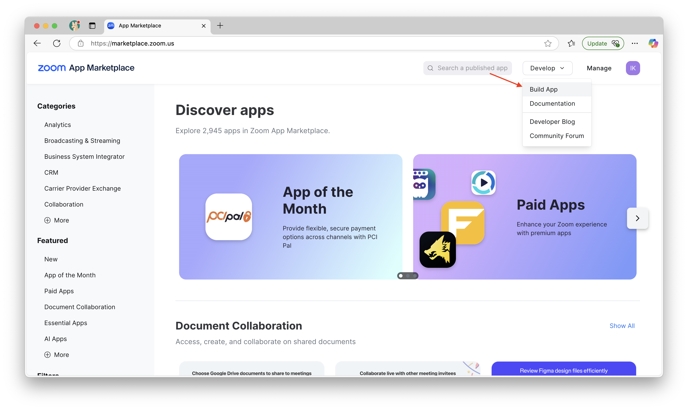
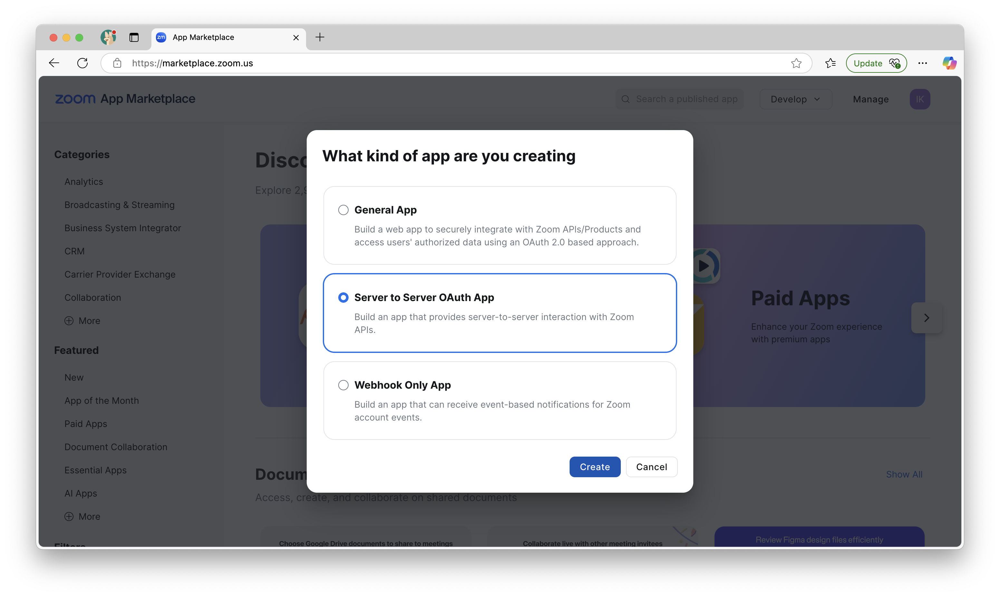
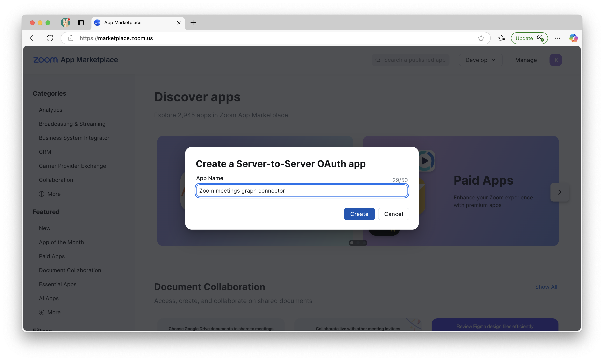
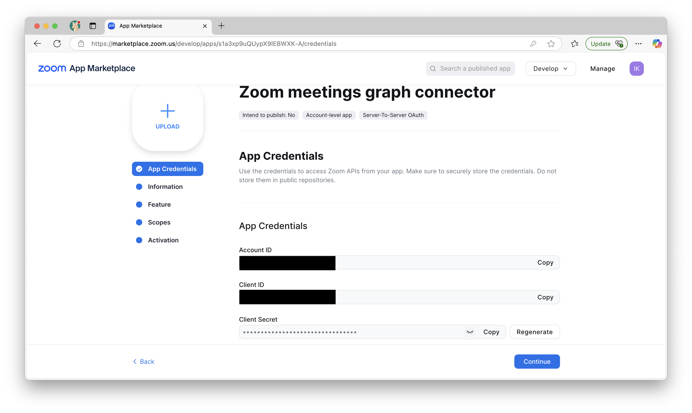
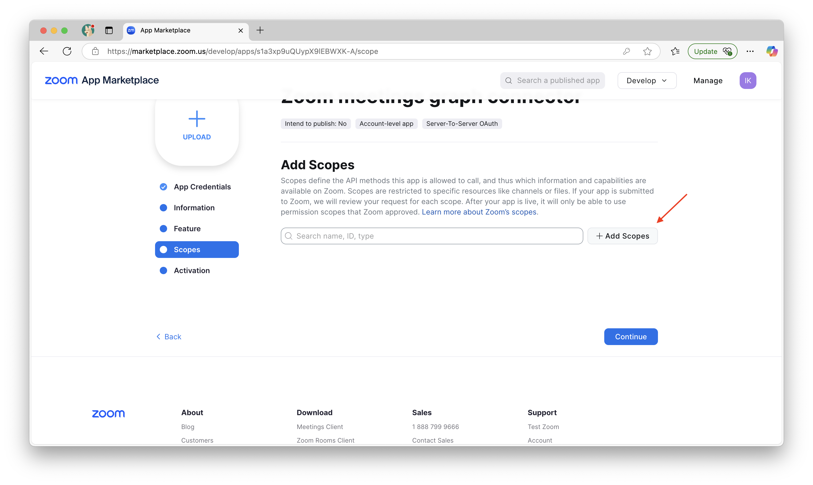
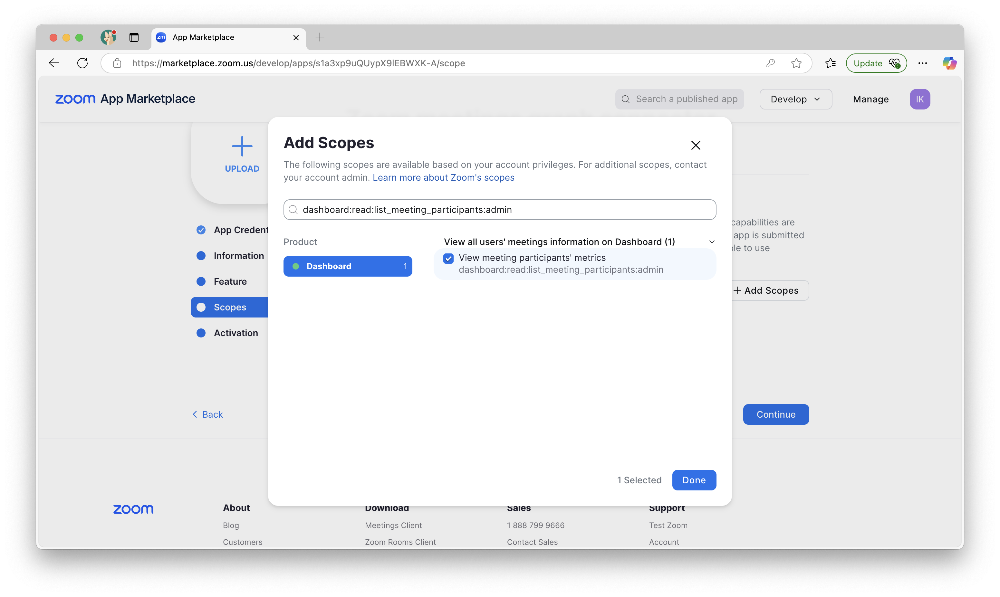
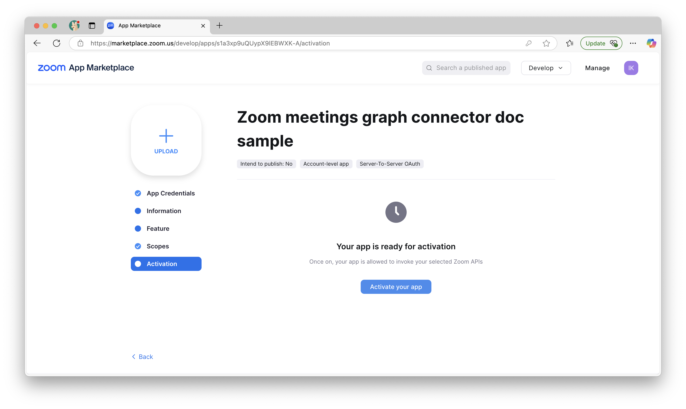
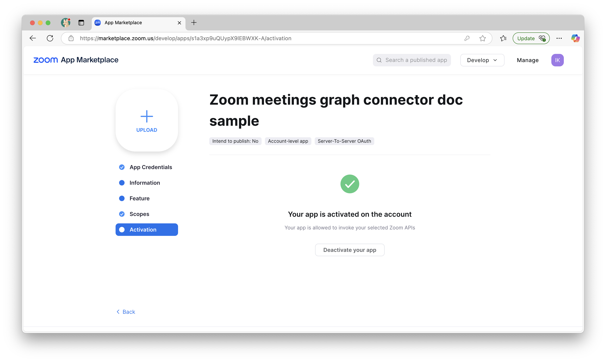

--- 
title: "Zoom meetings Graph connector for Microsoft Search and Copilot" 
ms.author: rerabo
author: vivg
manager: ereza
audience: Admin
ms.audience: Admin 
ms.topic: article 
ms.service: mssearch 
ms.localizationpriority: medium 
search.appverid: 
- BFB160 
- MET150 
- MOE150 
description: "Set up the Zoom meetings Microsoft Graph connector for Microsoft Search and Microsoft 365 Copilot" 
ms.date: 03/31/2025
---

# Zoom meetings Microsoft Graph connector (Preview)

With the Microsoft Graph connector for Zoom meetings, your organization can index meeting related artifacts such as transcripts, summary and meta data. This allows the owners of meetings to search for such information in Microsoft Copilot and from any Microsoft Search client.

This article is for Microsoft 365 administrators or anyone who configures, runs, and monitors a Zoom meetings Graph connector.

## Capabilities
- Index meeting related data such as transcript and summary. 
- Enable your end users to ask questions related to their Zoom meetings in Copilot. 
   - What are the action items from a specific meeting?
   - What are the outcomes of a specific meeting?
   - Summary of several meetings with a specific participant or on a specific subject.
- Use [Semantic search in Copilot](semantic-index-for-copilot.md) to enable users to find relevant content based on keywords, personal preferences, and social connections.

## Prerequisites
- You must be the **search admin** for your organization's Microsoft 365 tenant.
- **Zoom account**: To connect to your Zoom meetings data, you must have a paid Zoom plan (such as Pro, Business, or Enterprise) with cloud recording enabled.
- **Create a Zoom marketplace app for the Microsoft Graph connector**: By creating a Zoom marketplace app, you can allow and control the access by the Graph connector to your Zoom meetings data.

### Create Zoom marketplace app

Create a Zoom marketplace app for the Microsoft Graph connector:

1. Go to the Zoom marketplace at [https://marketplace.zoom.us](https://marketplace.zoom.us) and log-in using a Zoom admin credentials.

2. Hover over the "Develop" menu, and select "Build app":

3. Select "Server to server OAuth app" and click the Create button:

4. Provide a name for the app, and click Create:

5. In the next page, note the Client ID and the Client Secret. You will need to insert these details when configuring the connector in the next section:

6. Click continue

7. Fill out the information in the "Information" and "Feature" tabs, click continue to get to the "Scopes" tab.

8. Click the +Add scopes button and select the following scopes (use the value in brackets below to search for a scope, and mark the checkbox next to it to select it): 
   a. Dashboard → View all users’ meetings information on dashboard → View meeting metrics (dashboard:read:list_meetings:admin) 
   b. Dashboard →  View all users’ meetings information on dashboard → View meeting participants’ metrics (dashboard:read:list_meeting_participants:admin) 
   c. Meeting → View all user meetings → View a meeting (meeting:read:meeting:admin) 
   d. Recording → View all user recordings → Returns all of a meeting’s recordings (cloud_recording:read:list_recording_files:admin) 
   e. User → View all user information → View users (user:read:list_users:admin) 

9. Click Done and then click Continue.

10. In the final screen, click the Activate your app button:

11. Make sure the app is activated successfully:

## Get Started

### 1. Display name 
A display name is used to identify each citation in Copilot, helping users easily recognize the associated file or item. Display name also signifies trusted content. Display name is also used as a [content source filter](/MicrosoftSearch/custom-filters#content-source-filters). A default value is present for this field, but you can customize it to a name that users in your organization recognize.

### 2. Authentication Type

To authenticate and sync content from Zoom, choose **OAuth 2.0**.

Enter the Zoom account ID, the Client ID, and the Client secret which were created as part of the Zoom marketplace app before, to authenticate to your instance.

### 3. Roll out to limited audience
Deploy this connection to a limited user base if you want to validate it in Copilot and other Search surfaces before expanding the rollout to a broader audience. To know more about limited rollout, see [staged rollout](staged-rollout-for-graph-connectors.md).

At this point, you are ready to create the connection for Zoom meetings. You can click on the ‘Create’ button and the Microsoft Graph connector starts indexing meetings from your Zoom account.

For other settings, like Access Permissions, Data inclusion rules, Schema, Crawl frequency, etc., we have defaults set based on what works best with Zoom data. You can see the default values here:
- **Users**
   - Access Permissions: Only the **meeting owner** in Zoom has access to the meeting’s data in Microsoft Graph.
   - Map Identities: Data source identities mapped using Microsoft Entra IDs.
- **Content**
   - Manage Properties: To check default properties and their schema, select Custom Setup → Content
- **Crawl**
   - Incremental Crawl: Frequency: Every 15 mins
   - Full crawl: Frequency: Every day

If you want to edit any of these values, you need to choose the "Custom Setup" option.

## Custom Setup

Custom setup is for those admins who want to edit the default values for settings listed. Once you click on the "Custom Setup" option, you see three more tabs - Users, Content, and Sync.

### Users

**Access Permissions**

The Zoom meetings connector supports access permissions only for the original owner of a meeting in Zoom. 

**Mapping Identities**

The default method for mapping your data source identities with Microsoft Entra ID is by checking whether the Email ID of Zoom users is same as the UserPrincipalName (UPN), or Mail of the users in Microsoft Entra ID. If you believe this configuration would not work for your organization, you can provide a custom mapping formula. To know more about, mapping Non-EntraID identities, click [here](map-non-aad.md).

 
### Content

Choose the repositories and file types (initially markdown files and other non-code documentation) you wish to make searchable.

**Manage Properties**

Here, you can add or remove available properties from your Zoom data source, assign a schema to the property (define whether a property is searchable, queryable, retrievable, or refinable), change the semantic label and add an alias to the property. Properties that are selected by default are listed below.

**Source Property** | **Semantic Label** |**Description**| **Schema**
--- | ---- | --- | ---
Agenda| | Agenda of the meeting, if the meeting host included one when scheduling the meeting. | Search
Duration | |The recording duration. | Query, Search
Host | Created by | Meeting host’s name. | Query, Retrieve, Search
MeetingUUID | | The meeting's universally unique identifier. | Query
Participants | Authors | List of participants. | Retrieve
PlayRecordingUrl | url | A direct web link for streaming and viewing a Zoom meeting recording within a browser.	| Query, Retrieve
StartTime | Created date time | The start time of the recording. | Query, Refine, Retrieve
Topic | Title |	The title provided by the meeting host to summarize the subject or purpose of the Zoom meeting.	| Query, Retrieve
Transcript | | Text-based record of the spoken content of the meeting. | Search
WorkflowState | | | Retrieve

### Sync

The refresh interval determines how often your data is synced between the data source and the Graph connector index. There are two types of refresh intervals – full crawl and incremental crawl. For more information, see [refresh settings](configure-connector.md#guidelines-for-sync-settings).

## Troubleshooting
After publishing your connection, you can review the status under the **Data Sources** tab in the [admin center](https://admin.microsoft.com). To learn how to make updates and deletions, see [Manage your connector](manage-connector.md). 

If you have issues or want to provide feedback, contact [Microsoft Graph | Support](https://developer.microsoft.com/en-us/graph/support).
